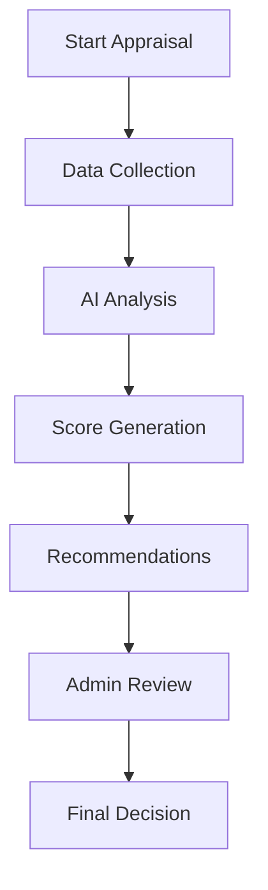

# Faculty Excellence Tracker (FET) 🎓

## Smart Education Solution for Faculty Career Advancement


### Problem Statement Details
- **ID**: 1613
- **Title**: Automated System for Career Advancements of the Faculties of Higher Education
- **Theme**: Smart Education
- **Category**: Software
- **Team ID**: 14600
- **Team Name**: Samdhan

## 📑 Table of Contents
- [Overview](#overview)
- [Key Features](#key-features)
- [System Architecture](#system-architecture)
- [Screenshots](#screenshots)
- [Feasibility Analysis](#feasibility-analysis)
- [Impact Assessment](#impact-assessment)
- [Benefits](#benefits)
- [Installation](#installation)
- [Usage](#usage)
- [Contact](#contact)

## Overview
FET revolutionizes faculty career advancement in higher education through AI-driven analytics and automated appraisal systems. Our platform streamlines the evaluation process while promoting continuous professional growth through data-driven insights and engagement features.

## Key Features

### 📝 Self-Appraisal Management
- Intuitive form submission interface
- Comprehensive evaluation criteria
- Automated validation and processing

### 🎯 Advanced Analytics
- AI-powered performance analysis
- Predictive career progression modeling
- Personalized improvement recommendations

### 📊 Data Integration
- ORCID profile synchronization
- CSV data import capability
- Seamless integration with university systems (LMS, HR, Research databases)

### 🏆 Engagement Features
- Gamified point system
- Achievement badges
- Interactive leaderboards

### 📈 Visualization & Insights
- Dynamic performance dashboards
- Trend analysis
- Comparative analytics

## System Architecture

### Complete FET System Flow


### Appraisal System Flow


## Screenshots

### Admin Interface
1. **Admin Dashboard**
   
   *Comprehensive overview of system metrics and faculty statistics*

2. **Profile Management**
   
   *Faculty profile administration and verification interface*

3. **Faculty Statistics**
   
   *Detailed analytics and performance metrics visualization*

### Faculty Interface
1. **Faculty Dashboard**
   
   *Personalized overview of performance and achievements*

2. **Profile Management**
   
   *Self-service profile updates and ORCID integration*

3. **Performance Analytics**
   
   *Detailed performance insights and trend analysis*

4. **Leaderboard**
   
   *Gamified ranking system showcasing achievements*

## Feasibility Analysis

### Technical Feasibility
- Built on robust cloud infrastructure
- Leverages modern AI/ML technologies
- Seamless integration capabilities
- Scalable architecture

### Operational Feasibility
- Intuitive user interface
- Comprehensive onboarding support
- Regular maintenance and updates
- Strong technical support system

### Financial Feasibility
- Freemium business model
- Scalable revenue streams
- Cost-effective implementation
- Clear ROI for institutions

## Impact Assessment

### Faculty Benefits
- Data-driven career progression
- Transparent evaluation system
- Continuous professional development
- Enhanced engagement through gamification

### Administrative Benefits
- Streamlined decision-making
- Reduced paperwork
- Improved resource allocation
- Enhanced institutional quality metrics

## Benefits

### 🌍 Social Impact
- Promotes academic excellence
- Fosters competitive spirit
- Encourages continuous learning
- Improves faculty satisfaction

### 💰 Economic Impact
- Reduces administrative costs
- Enhances institutional reputation
- Improves resource utilization
- Drives academic quality

### 🌱 Environmental Impact
- Paperless operations
- Reduced carbon footprint
- Sustainable practices
- Digital-first approach

## Installation

```bash
# Clone the repository
git clone https://github.com/yourusername/FET.git

# Install dependencies
npm install

# Configure environment variables
cp .env.example .env

# Start the application
npm start
```

## Usage

1. Register your institution
2. Set up administrator accounts
3. Import faculty data
4. Configure evaluation parameters
5. Begin using the system

## Contact

For support or queries, reach out to us:
- Email: support@fet.edu
- Website: www.fet.edu
- GitHub: github.com/FET

---

© 2024 Faculty Excellence Tracker. All rights reserved.
